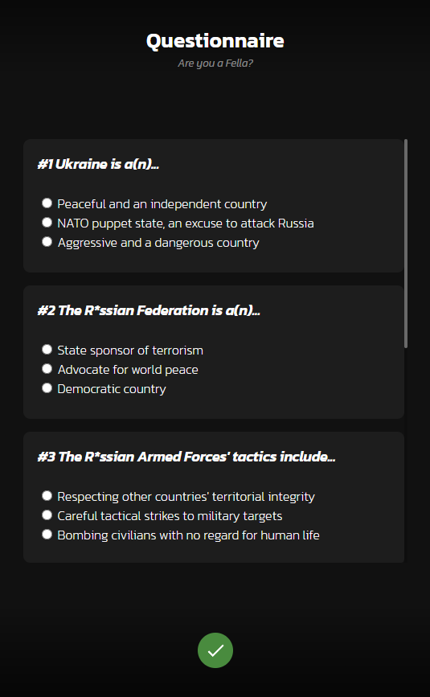

# CreateAFella
A vanilla JavaScript [NAFO](https://en.wikipedia.org/wiki/NAFO_(group)) "Fella" character creator. Hosted on Github.

### [Open the app](https://hakorr.github.io/CreateAFella)

## 🎨 Preview

| Questionnaire | Editor | Settings |
|---------------|--------|----------|
||||

## 📉 Project status

Discontinued due to no motivation to design clothes. Since I don't have the motivation to design clothes, I don't have the motivation to develop more features and overall just improve the app in any way. If you're good with vector art and item designing in general, you could reach out if you want to help. Maybe we could finish the project one day. 

Anyway, this was more of a personal project to see how character creators function. Honestly my approach is not the best and is another reason why I just didn't want to continue developing, or to even publish the project. As you can probably see I figured it's still better to publish this than to move the whole project to my recycle bin. Maybe you can learn new things from this, or something, I don't know.

## 🗄️ Running locally

1. Use a web server of your choosing (e.g. [XAMPP](https://www.apachefriends.org/download.html))
2. Download the repository files and make sure you have them on the correct folder so the server can serve them
3. Start the web server to localhost:80
4. Open [localhost:80](http://localhost:80) on your browser

## 🍺 Buy me a beer

Please don't. I don't drink nor want to receive donations for an inactive project.
